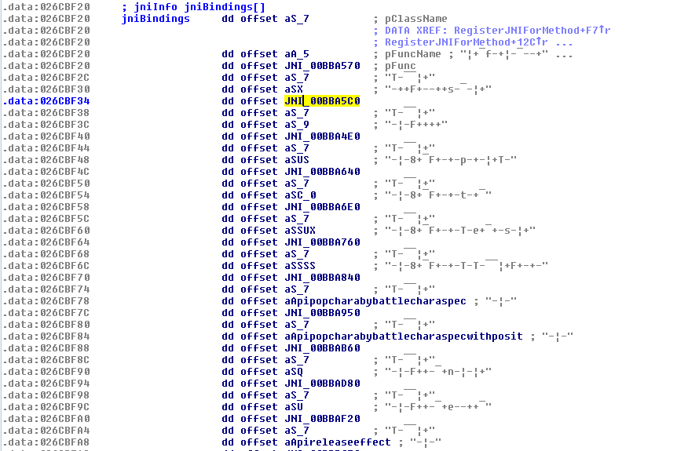
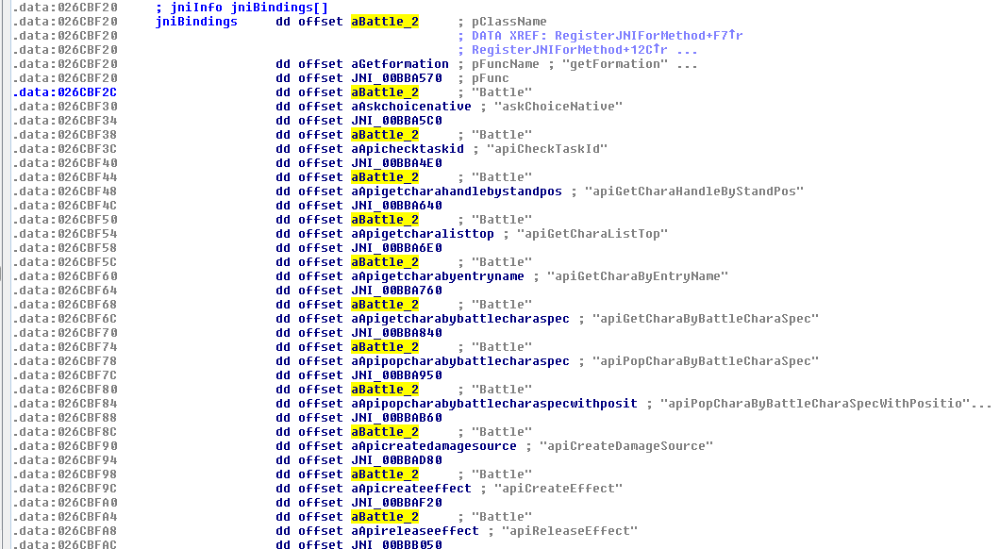
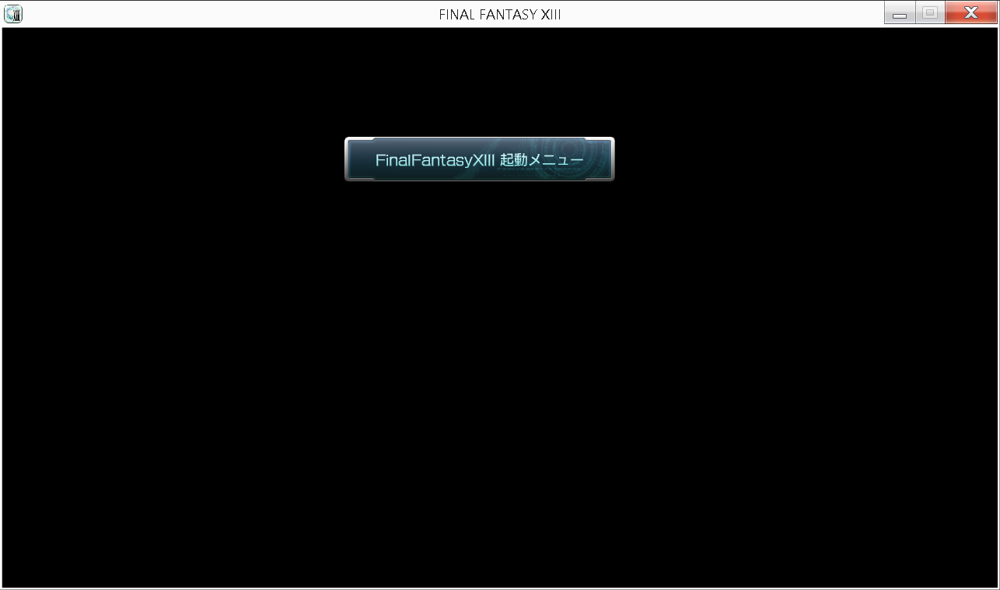

## JNI

Like I said last time, I'm going to patch the function `White.isUserBoot()` to return false,
so that the debugging options appear. Inside of the `White` class that function looks like

```java
public class White
{
	public static native boolean isUserBoot();
}
```

### Binding

It's marked native so I to have to reverse how the engine handles JNI functions.
Inside of the code that loads clb/class files there is a for loop that iterates over all
of the methods in a class and calls a function that associates that method with jni info.

Hex-rays'd loop:

```c++
for ( jj = 0; jj < a1a->methods_count; ++jj )
{
	RegisterJNIForMethod(a1a, &a1a->pMethod_info[jj]);
	v23 = GetUtf8StringFromConstantPool(a1a, a1a->pMethod_info[jj].name_index);
	a1a->pMethod_info[jj].name_hash = calcJvmHash(v23);
	v24 = GetUtf8StringFromConstantPool(a1a, a1a->pMethod_info[jj].descriptor_index);
	a1a->pMethod_info[jj].descriptor_hash = calcJvmHash(v24);
	a1a->pMethod_info[jj].flags = 0;
	if ( sub_BEE5E0(&a1a->pMethod_info[jj], a1a, a1a->pMethod_info[jj].name_hash, "main") )
		a1a->pMethod_info[jj].flags |= 1u;
	else
		a1a->pMethod_info[jj].flags &= 0xFFFEu;
}
```

`a1a` is an instance of the `CLBFile` class I described in the last write-up.
Hex-rays of RegisterJNIForMethod:

```c++
signed int __cdecl RegisterJNIForMethod(CLBFile *a1, method_info *methodInfo)
{
    signed int j; // [esp+0h] [ebp-320h]@10
    signed int k; // [esp+0h] [ebp-320h]@14
    CHAR *v5; // [esp+4h] [ebp-31Ch]@8
    char v6; // [esp+8h] [ebp-318h]@8
    int i; // [esp+20Ch] [ebp-114h]@1
    char v8[132]; // [esp+210h] [ebp-110h]@17
    int v9; // [esp+294h] [ebp-8Ch]@1
    char v10[132]; // [esp+298h] [ebp-88h]@13

    v9 = 0;
    for ( i = 0; *(a1->pThis_classname + i); ++i )
    {
        if ( *(a1->pThis_classname + i) == 47 )
            v9 = i + 1;
    }
    if ( v9 >= 512 )
    {
        printf("class name too long\n");
        sub_BEBA60("class name too long");
    }
    strcpy(&v6, a1->pThis_classname + v9, 512);
    v5 = GetUtf8StringFromConstantPool(a1, methodInfo->name_index);
    for ( i = 0; ; ++i )
    {
        if ( !*jniBindings[i].pClassName )
        {
            *&methodInfo->reserved[0] = 0;
            return 1;
        }
        for ( j = 0; jniBindings[i].pClassName[j] && j < 127; ++j )
            v10[j] = jniBindings[i].pClassName[j] ^ 0xAB;
        v10[j] = 0;
        for ( k = 0; jniBindings[i].pFuncName[k] && k < 127; ++k )
            v8[k] = jniBindings[i].pFuncName[k] ^ 0xAB;
        v8[k] = 0;
        if ( !strcmp(&v6, v10) && !strcmp(v5, v8) )
            break;
    }
    if ( methodInfo->access_flags & 0x100 )
    {
        *&methodInfo->reserved[0] = jniBindings[i].pFunc;
    }
    else
    {
        printf("can't find native method [%s/%s]\n", &v6, v8);
        sub_BEBA60("can't find native method");
    }
    return 1;
}
```

First it loops over all of the entires in jniBindings, which I'll get to in a second,
and compares the method name and class name associated with the binding to the method
name and class name of the method that it was called with. Notice the `0xAB` xor,
that'll become important in a minute. If a match is found and the access_flags has
bit `0x100(ACC_NATIVE)` set, then it sets a field in the method info to a pointer to
the binding's associated native code function. There's a problem though, look at
the data contained in `jniBindings`:



It's all fucked up. Thankfully it's just a simple xor with `0xAB` and can be fixed
easily by an idc script

```c
static fixString(ea)
{
    auto needsfix = 0, i = 0;
    while(1)
    {
        auto c = Byte(ea+i);
        if(c == 0)
        {
            break;
        }
        if(c & 0x80)
        {
            needsfix = 1;
            break;
        }
        i = i + 1;
    }
    
    if(needsfix)
    {
        i = 0;
        while(1)
        {
           auto c2 = Byte(ea+i);
           if(c2 == 0)
           {
               break;
           }
           PatchByte(ea+i, c2^0xAB);
           i = i + 1;
       }
    }
    MakeStr(ea, -1);
}

static fixJni()
{
    auto ea = 0x026CBF20;
    while(1)
    {
        auto pClassname, pFuncname, pFunc;
        pClassname = Dword(ea);
        pFuncname = Dword(ea+4);
        pFunc = Dword(ea+8);
        
        if(pClassname == 0)
        {
            break;
        }
    
        fixString(pClassname);
        fixString(pFuncname);
        
        if(strstr(Name(pFunc), "sub_") == 0)
        {
            MakeNameEx(pFunc, sprintf("JNI_%08X", pFunc), 0x20);
        }
    
        ea = ea + 12;
    }
}
```

This script also replaces IDA's default `sub_` prefix with `JNI_` to show that
it's a function called from jni when you're looking at the random xrefs of whatever.



Isn't that much better? It's now easy to figure out which native code function is
associated with `White.isUserBoot()`.

### Patching

```c++
BOOL __cdecl JNI_White_isUserBoot(int a1)
{
    BOOL v1; // ST04_4@1
    BOOL result; // eax@1

    v1 = (pAppGame->bootMode & BOOT_UserMode) != 0;
    *(a1 + 276) -= 8;
    **(a1 + 276) = 1;
    result = v1;
    *(*(a1 + 276) + 4) = v1;
    return result;
}
```

`a1` is some weird JNI object that I don't really care about, but you can see
that the return value is set based off of whether or not the `BOOT_UserMode(0x200)`
flag is set in `pAppGame->bootMode`. `pAppGame` is a pointer to the global game
object. I didn't know this at the time so in hex-rays it showed up along the lines
of `(dword_XXXXXXXX + offset)`. The easy way to change the return value of this
function would be to patch this it to always return 0, but that wouldn't exactly work
because there could be other functions that also check the bootMode member. The way I
got around this is by patching it where it's initially set. I did an immediate search
for all instances of the offset from `pAppGame`, `408h`, and then inspected all of the
functions until I found one that was setting the boot mode. I found a function I'm calling
`AppGame::Initializer` that or'd the bootmode with `0x200`. It doesn't look like
their compiler's optimizer is very good though, take a look at the assembly that
ors it with `0x200`:

```assembly
.text:0040989B     ; 184:     v23->bootMode |= BOOT_UserMode;
.text:0040989B 1A0                 mov     edx, [ebp+var_138]
.text:004098A1 1A0                 add     edx, 408h
.text:004098A7 1A0                 mov     [ebp+var_C0], edx
.text:004098AD 1A0                 mov     eax, 9
.text:004098B2 1A0                 shr     eax, 5
.text:004098B5 1A0                 mov     ecx, 9
.text:004098BA 1A0                 and     ecx, 1Fh
.text:004098BD 1A0                 mov     edx, 1
.text:004098C2 1A0                 shl     edx, cl
.text:004098C4 1A0                 mov     ecx, [ebp+var_C0]
.text:004098CA 1A0                 mov     eax, [ecx+eax*4]
.text:004098CD 1A0                 or      eax, edx
.text:004098CF 1A0                 mov     ecx, 9
.text:004098D4 1A0                 shr     ecx, 5
.text:004098D7 1A0                 mov     edx, [ebp+var_C0]
.text:004098DD 1A0                 mov     [edx+ecx*4], eax
```

It does a bunch of shifting around nonsense, I don't see why the compiler didn't
replace those with immediate constants but I'm not a compiler engineer so,
¯\\\_(ツ)\_/¯. Nopping out the `or      eax, edx` is sufficient to prevent the
usermode boot flag from being set.

If you take a look at the decompiled code of the [WhiteResident](http://pastebin.com/qwG8aPB2)
class again you can see that besdies `White.isUserBoot()`, `White.getPlayMode()`
is also checked. That can be patched using a similar method to `isUserBoot`.
Thankfully, the White class actually defines all the possible play modes.


```java
public class White
{
    public static final int PlayModeDebug = 0;
    public static final int PlayModeRelease = 1;
    public static final int PlayModeAlpha = 2;
    public static final int PlayModeBeta = 3;
    public static final int PlayModeTgs = 4;
    public static final int PlayModeE3 = 5;
}
```

I patched my copy of the game to set the play mode to 0, or debug.

So now I'm ready to boot up the game and get into the debug menu, right? Wrong.



I can see the title of what's supposed to be a menu prompt, "FinalFantasyXIII 起動メニュー",
set by `common.sfMesMenuNoSync(440, 140, 35, 5, "FinalFantasyXIII 起動メニュー", true);`, but
there are no options. If I use the arrow keys, dpad, or scroll my mousewheel I can hear
the 'ding' that you hear normally when scrolling through options, and random things happen
when I click or hit enter but it's kind of hard having no idea what's actually happening.

I'm not sure if the prompt options are supposed to show up in a connected instance of
Crystal Tools(their game engine and editor), or if the code for displaying options on this
kind of menu were just stripped out of the release build. To get around this I'm going to
write a dll that'll hook into `Window.askChoice` and display and let you select from the
options in a console window so that you know wtf is actually goin' on.