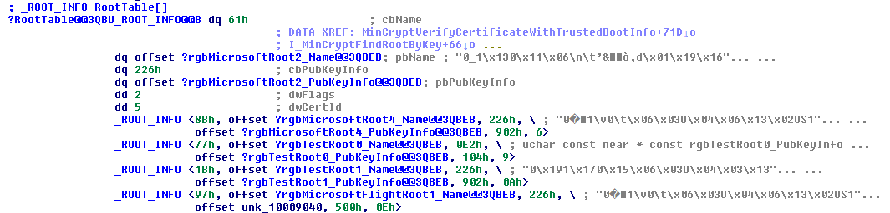

# Patching Yourself into Windows Code Integrity, Part 1: On-Disk Patching

## My Machine, My Code

I started this whole thing because I wanted to run my own kernel-mode code while still having access games protected by
anti-cheat that don't allow test signing, and I didn't want to shell out the time and money required to get an EV
certificate. Really what I wanted to do was use PCI passthrough with a consumer NVIDIA GPU, but to do that you need to
patch their driver, and to do that you need to be able to re-sign it. Even if you do have a valid code signing
certificate there are still some restrictions on the types of drivers you can create, for example you can't create an
early boot driver(these can only be signed certificates that Microsoft won't give to anyone except themselves and large
A/V companies). The "traditional" way to do this is to use something like
[UPGDSED](https://github.com/hfiref0x/UPGDSED), but while this allows you to run your own code it also allows any other
malicious code to run, and greatly reduces security by disabling KPP(patchguard). It doesn't solve the early boot
driver problem either. The root of trust has to be established somewhere, so why don't we just add ourselves to it?

As far as I can tell, at least [one](http://www.alex-ionescu.com/?p=24) other person has done this before me, but
nobody has publicly documented the process.

I'm going to start out by patching binaries on disk, but the end result will be a UEFI application that patches all
binaries in memory.

## A note on UEFI Secure Boot and Hypervisor Based Code Integrity
This series is going to focus on normal/old code integrity, not that new fancy hypervisor based stuff. Mostly because
I don't have a good hardware platform to test/debug it with. For the same reason I'm not going to focus on UEFI/Secure
Boot. I will say though that there are many intel motherboard manufacturers that don't blow the fuses on the PCH,
allowing you to flash your own firmware onto the board and run whatever you want if you so desire. You can also find
the intel system tools if you search around, so in theory you could create your own firmware signing key, sign your
patched firmware, and then blow the fuses yourself. You can also put your own secure boot keys in the firmware setup
utility if it allows you to do so.

## PKI

Before we go about signing anything we need to setup a PKI. Let's look at the certificate chain used to sign
`bootmgfw.efi`.


They have a root CA, an intermediate CA, and then a code signing certificate. The root CA is a run-of-the-mill
SHA256 RSA4096 certificate, and we can create our own by running:

```
makecert -pe -n "CN=NotNSA Root CA" -sv NotNSARoot2.pvk -a sha256 -sky signature -r -cy authority -len 4096 -e 01/01/2021 NotNSARoot2.crt
```

The code signing certificate has two EKUs defined:

* `1.3.6.1.4.1.311.10.3.6` - Windows System Component Verification
* `1.3.6.1.5.5.7.3.3` - Code Signing

We can create a code signing certificate signed by our CA using the following command:

```
makecert -pe -n "CN=NotNSA Windows" -sv NotNSAWindows2.pvk -a sha256 -sky signature -cy end -len 2048 -e 01/01/2020 -ic NotNSARoot2.crt -iv NotNSARoot2.pvk NotNSAWindows2.crt
```

## bootmgfw.efi and winload.efi

Bootmgfw is the first windows component that will run on a computer, and therefore is the root of trust(ignoring the
UEFI firmware).

Both bootmgfw and winload use the same signature verification code, so if you figure out how to patch one you can patch
the other very easily.

The first thing I did was search for the subject name of the root certificate. That brought me to an ASN.1 encoded blob
that had the name(after demangling) `unsigned char const near * const rgbMicrosoftRoot4_Name`. Following the cross
references I was brought to a "root table", with the name `struct _ROOT_INFO const * const RootTable`. The _ROOT_INFO
type was not defined in the public PDB so I had to figure it out myself, it was a list of pointers to ASN.1 encoded
subject names, ASN.1 encoded public keys, and some numbers. After some playing around (pressing the `d` key in IDA
and seeing what stuck), I came up with the following structure:

```c
typedef struct _ROOT_INFO
{
	QWORD cbName;
	unsigned char const* pbName;
	QWORD cbPubKeyInfo;
	unsigned char const* pbPubKeyInfo
	DWORD dwFlags;
	DWORD dwCertID;
} ROOT_INFO, *PROOT_INFO;
```



The `dwCertID` field seemed to match up with the "well-known" certificates used by the [Windows 10 S System Integrity
policy](https://tyranidslair.blogspot.com/2017/07/device-guard-on-windows-10-s_20.html).

Because of the way that the table was structured it wouldn't be that trivial to add another entry to it, so I decided
to replace one of the testing roots instead. I replaced the name and public key with those from my root certificate,
and then set the `dwFlags` field to the same value as the Microsoft Root 4. I signed the patched file and tried to boot,
and hey, it worked! Bootmgfw checks it's own integrity so if it's signed incorrectly it will either bluescreen or print
a warning message to WinDbg's log depending on whether or not a debugger is attached. Bootmgfw then verifies and starts
winload, which verifies the kernel and all early boot drivers. After patching winload, I can sign my own kernel and
early boot drivers and libraries that they depend on, such as CI.dll.

## Initial Load Attempt

I wanted to see what would happen if I tried to load a driver signed with my cert without patching anything else, so I
could get a hint of what I needed to patch next. I make a KMDF hello world driver and then signed it with the same cert
I signed the bootloader with. I attached a kernel debugger to my VM and tried to load the driver with devcon. I was
presented with the following screen:


## wintrust and crypt32

Nothing printed to my kernel debugger, so I assumed that this check was happening in user-mode somewhere and I tried to
track it down. I watched what dlls were loaded into the devcon procress and `wintrust.dll` caught my eye. Wintrust
pointed me to a function called `CertVerifyCertificateChainPolicy` in `crypt32.dll`. I looked around the strings of
crypt32 and found a resource called `AUTHROOTS` in some binary format that contained a bunch of certificates. I figured
out that windows has it's own certificate store binary format and you can use
[certmgr](https://docs.microsoft.com/en-us/windows/desktop/seccrypto/using-certmgr) to manipulate these files. 

I added my root CA to the store and replaced the resource using
[Resource Hacker](http://www.angusj.com/resourcehacker/). I wasn't able to get the edited file signed at first, I kept
getting a "Bad exe format" error, but after some debugging I figured out that if you try to edit a signed PE file with
resource hacker it will end up corrupting the file. You have to strip the signature out with signtool first. 

## CI.dll

After editing, I signed the modified crypt32 with my certificate, attached a kernel debugger, and attempted to boot. I
was given the following error in the output of my kernel debugger:

```
******************************************************************
* This break indicates this binary is not signed correctly: \Device\HarddiskVolume4\Windows\System32\crypt32.dll
* and does not meet the system policy.
* The binary was attempted to be loaded in the process: \Device\HarddiskVolume4\Windows\System32\smss.exe
* This is not a failure in CI, but a problem with the failing binary.
* Please contact the binary owner for getting the binary correctly signed.
******************************************************************
```

This message was printed by `CI.dll`. I searched its strings for certificate subject names and found two root tables.
They were both very similar to the root table in the bootloader, but different from it and from each other. I did the
same sort of patching to them as I did to the bootloader and then it booted with my modified crypt32.

It turns out modifying crypt32 wasn't necessary at all. I was trying to get it to implicitly trust my root CA so I
wouldn't have to manually add it to the trusted root store, but it didn't work. Code Integrity was also throwing
errors into the event log because while I signed crypt32 for boot, I didn't catalog sign it which is required after
the system has been booted. I restored the original crypt32 binary and then manually added my root certificate to the
trusted roots store the normal way(double clicking the cert and clicking install certificate etc etc). After doing
that I tried installing my driver and hey, it worked!


Notice the lack of the test mode watermark on the bottom right.

## Conclusions

Writing a UEFI app that will persist through the boot path is going to be a pain. One thing that I would like to look
into but haven't yet is the "Secure Boot Policy", which has nothing to do with UEFI secure boot confusingly enough.
You may recognize the term, a secure boot policy is the "golden key" that unlocked Windows RT devices. It's also
possible that device guard is an evolution of secure boot policies, so device guard documentation may aid in reversing.
The default secure boot policy is stored as a resource of bootmgfw, and from an initial glance doesn't have a signature
(a signature is present when the policy is an external file). So if UEFI will boot bootmgfw, then whatever secure boot
policy is embedded in it will be used unless another one is provided. Some strings and symbols have hinted to me that
it may be possible to add an additional signer certificate using a secure boot policy. As far as I know too, nobody has
publicly documented the secure boot policy format, so that might be fun to do anyways.

If you have any questions or comments, feel free to get in touch with me on reddit
[/u/Avery3R](https://reddit.com/r/avery3r) or twitter [@Avery3R](https://twitter.com/avery3r).